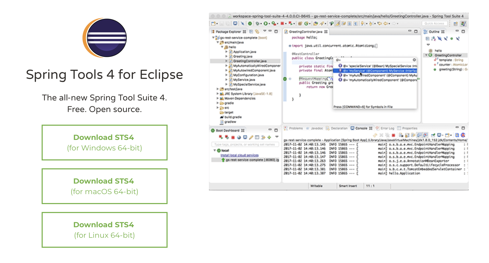
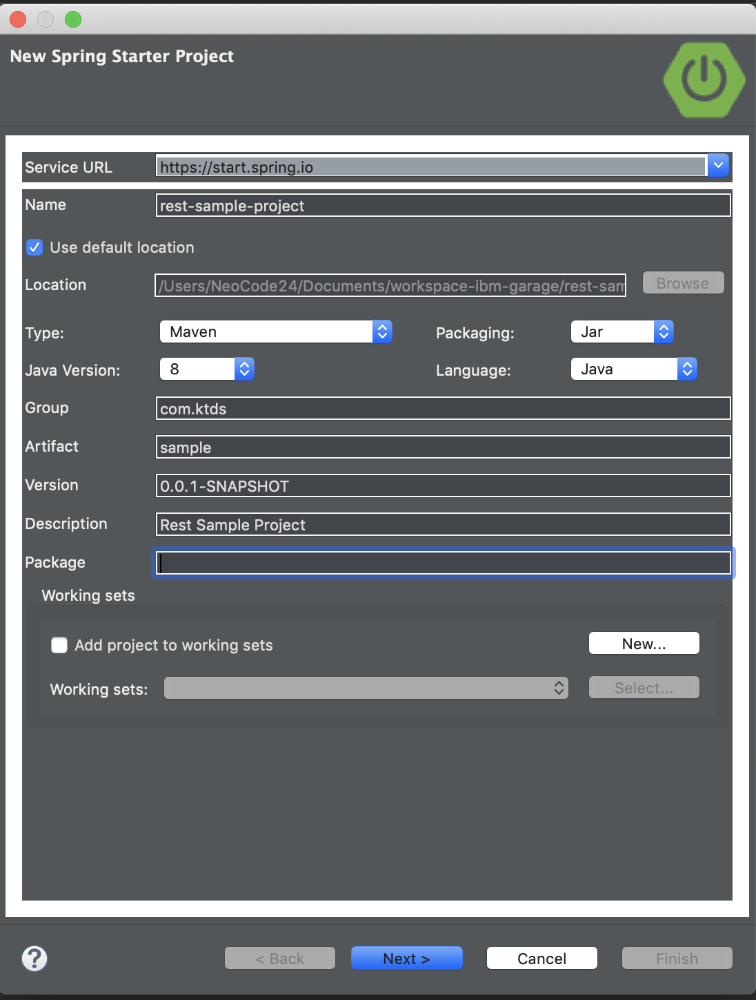

## 0. Spring Boot ? (5분)

1. Web으로 제공
2. SpringFramework 은 이제 고인물
3. 좀더 쉽게 접근하자...
4. Web Application Server 의 기능이 모두 다 필요 할까?

## 1. Spring Boot 개발 툴 설치 (10분 ~ 15분)

1. Spring Tool Suite (이하 STS) 다운로드 및 설치

```
https://spring.io/tools
```



## 2. Project 생성하기 (10분 ~ 15분)

1. Spring Starter Project 실행

   

2. Project 초기 설정

   - Name 지정하고, type으로 Maven 지정. Java 버전은 8로 함.
   - Packaging은 Jar 또는 War 무관.



1. Project Dependencies 지정

   - 주요 Spring Boot Starter 지정

   - Web 기반에서는 Web만 지정.

   - 그외 Starter 내용들

     - Actuator : Spring Boot Application 상태 관리 기능.

       ```
       https://supawer0728.github.io/2018/05/12/spring-actuator/
       ```

     - DevTools : 편리한 개발환경 세팅을 제공하기 위한 용도. automatic restart, livereload 기능 등..

       ```
       http://haviyj.tistory.com/11
       ```

     - Mybatis, PostgreSQL, RabiitMQ : DB 및 Queue 저장소 관련 기능

     - Security : 기존 Spring Security 관련한 인증 및 권한 기능

       ```
       http://heowc.tistory.com/4
       ```

     

## 3. Project 기능 개발 하기 (20분 ~ 30분)

1. Project 탐색 하기

   - src/main/java : 개발 코드 위치

   - src/main/resource : 정적 또는 설정 관련 파일 위치

   - src/test/java : 테스트 코드 위치

   - Maven Dependencies : pom.xml 에 기술된 필요 연관 Library등의 관계 확인. Project에서 실제 참조하고 있는 내용.

   - mvnw : Maven Wrapper

   - pom.xml : Project Object Model. 

     ```
     https://araikuma.tistory.com/447
     ```

   - ***Application.java : Start Class

   

2. 코드 생성하기

   - Controller - BookController.java

     ```
     package com.javasampleapproach.spring.postgresql.controller;
     
     import java.util.ArrayList;
     import java.util.List;
     import java.util.Optional;
     
     import javax.validation.Valid;
     
     import org.springframework.beans.factory.annotation.Autowired;
     import org.springframework.http.HttpStatus;
     import org.springframework.http.ResponseEntity;
     import org.springframework.web.bind.annotation.CrossOrigin;
     import org.springframework.web.bind.annotation.DeleteMapping;
     import org.springframework.web.bind.annotation.GetMapping;
     import org.springframework.web.bind.annotation.PathVariable;
     import org.springframework.web.bind.annotation.PostMapping;
     import org.springframework.web.bind.annotation.PutMapping;
     import org.springframework.web.bind.annotation.RequestBody;
     import org.springframework.web.bind.annotation.RequestMapping;
     import org.springframework.web.bind.annotation.RestController;
     
     import com.javasampleapproach.spring.postgresql.model.Book;
     import com.javasampleapproach.spring.postgresql.repo.BookRepository;
     
     @CrossOrigin(origins = "http://localhost:8081")
     @RestController
     @RequestMapping("/api")
     public class BookController {
     
     	@Autowired
     	BookRepository bookRepository;
     
     	@GetMapping("/books")
     	public List<Book> getAllBooks() {
     		System.out.println("Get all Books...");
     
     		List<Book> list = new ArrayList<>();
     		Iterable<Book> customers = bookRepository.findAll();
     
     		customers.forEach(list::add);
     		return list;
     	}
     
     	@PostMapping("/books/create")
     	public Book createBook(@Valid @RequestBody Book book) {
     		System.out.println("Create Book: " + book.getTitle() + "...");
     
     		return bookRepository.save(book);
     	}
     
     	@GetMapping("/books/{id}")
     	public ResponseEntity<Book> getBook(@PathVariable("id") Long id) {
     		System.out.println("Get Book by id...");
     
     		Optional<Book> bookData = bookRepository.findById(id);
     		if (bookData.isPresent()) {
     			return new ResponseEntity<>(bookData.get(), HttpStatus.OK);
     		} else {
     			return new ResponseEntity<>(HttpStatus.NOT_FOUND);
     		}
     	}
     
     	@PutMapping("/books/{id}")
     	public ResponseEntity<Book> updateBook(@PathVariable("id") Long id, @RequestBody Book book) {
     		System.out.println("Update Book with ID = " + id + "...");
     
     		Optional<Book> bookData = bookRepository.findById(id);
     		if (bookData.isPresent()) {
     			Book savedBook = bookData.get();
     			savedBook.setTitle(book.getTitle());
     			savedBook.setAuthor(book.getAuthor());
     			savedBook.setDescription(book.getDescription());
     			savedBook.setPublished(book.getPublished());
     
     			Book updatedBook = bookRepository.save(savedBook);
     			return new ResponseEntity<>(updatedBook, HttpStatus.OK);
     		} else {
     			return new ResponseEntity<>(HttpStatus.NOT_FOUND);
     		}
     	}
     
     	@DeleteMapping("/books/{id}")
     	public ResponseEntity<String> deleteBook(@PathVariable("id") Long id) {
     		System.out.println("Delete Book with ID = " + id + "...");
     
     		try {
     			bookRepository.deleteById(id);
     		} catch (Exception e) {
     			return new ResponseEntity<>("Fail to delete!", HttpStatus.EXPECTATION_FAILED);
     		}
     
     		return new ResponseEntity<>("Book has been deleted!", HttpStatus.OK);
     	}
     }
     
     ```

   - Model - Book.java

     ```
     package com.javasampleapproach.spring.postgresql.model;
     
     import java.io.Serializable;
     
     import javax.persistence.Column;
     import javax.persistence.Entity;
     import javax.persistence.GeneratedValue;
     import javax.persistence.GenerationType;
     import javax.persistence.Id;
     import javax.persistence.Table;
     
     @Entity
     @Table(name = "book")
     public class Book implements Serializable {
     
     	private static final long serialVersionUID = 1L;
     
     	@Id
     	@GeneratedValue(strategy = GenerationType.AUTO)
     	private long id;
     
     	@Column(name = "title")
     	private String title;
     
     	@Column(name = "author")
     	private String author;
     
     	@Column(name = "description")
     	private String description;
     
     	@Column(name = "published")
     	private int published;
     
     	protected Book() {
     	}
     
     	public long getId() {
     		return id;
     	}
     
     	public String getTitle() {
     		return title;
     	}
     
     	public void setTitle(String title) {
     		this.title = title;
     	}
     
     	public String getAuthor() {
     		return author;
     	}
     
     	public void setAuthor(String author) {
     		this.author = author;
     	}
     
     	public String getDescription() {
     		return description;
     	}
     
     	public void setDescription(String description) {
     		this.description = description;
     	}
     
     	public int getPublished() {
     		return published;
     	}
     
     	public void setPublished(int published) {
     		this.published = published;
     	}
     
     	@Override
     	public String toString() {
     		return "Book [id=" + id + ", title=" + title + ", author=" + author + ", description=" + description
     				+ ", published=" + published + "]";
     	}
     
     }
     
     ```

   - Repository - BookRepository.java

     ```
     package com.javasampleapproach.spring.postgresql.repo;
     
     import org.springframework.data.repository.CrudRepository;
     
     import com.javasampleapproach.spring.postgresql.model.Book;
     
     public interface BookRepository extends CrudRepository<Book, Long> {
     
     }
     
     ```

   - Properties - application.properties

     ```
     spring.datasource.url=jdbc:postgresql://localhost/testdb
     spring.datasource.username=postgres
     spring.datasource.password=123
     spring.jpa.generate-ddl=true
     
     spring.jpa.properties.hibernate.jdbc.lob.non_contextual_creation=true
     ```

1. Project 응용 하기

   - 이전 Project를 호출하는 BFF(Back-end for Front-end) 서비스 Project 새로 만들기

   - Controller - FrontController.java

     ```
     package com.javasampleapproach.spring.frontend.controller;
     
     import com.javasampleapproach.spring.frontend.model.Book;
     import org.springframework.beans.factory.annotation.Autowired;
     import org.springframework.beans.factory.annotation.Value;
     import org.springframework.web.bind.annotation.CrossOrigin;
     import org.springframework.web.bind.annotation.GetMapping;
     import org.springframework.web.bind.annotation.RequestMapping;
     import org.springframework.web.bind.annotation.RestController;
     import org.springframework.web.client.RestTemplate;
     
     import java.util.List;
     
     @CrossOrigin
     @RestController
     @RequestMapping("/api")
     public class FrontController {
     
         @Autowired
         RestTemplate restTemplate;
     
     
         @Value("${target.service.name}")
         private String targetServiceName;
     
     
         @GetMapping("/books")
         public List<Book> getAllBooks() {
             System.out.println("Get all Books in FrontEnd");
     
             String url = "http://" + targetServiceName + "/api/books";
     
             System.out.println("Request Uri: " + url);
     
     //        return restTemplate.postForObject(url, null, List.class);
             List<Book> resultList = restTemplate.getForObject(url, List.class);
     
             System.out.println("Response Data: " + resultList.toString());
     
             return resultList;
         }
     }
     
     ```

   - Model - Book.java

     ```
     package com.javasampleapproach.spring.frontend.model;
     
     import java.io.Serializable;
     
     public class Book implements Serializable {
     
         private long id;
     
         private String title;
     
         private String author;
     
         private String description;
     
         private int published;
     
         protected Book() {
         }
     
     
         public long getId() {
             return id;
         }
     
         public String getTitle() {
             return title;
         }
     
         public void setTitle(String title) {
             this.title = title;
         }
     
         public String getAuthor() {
             return author;
         }
     
         public void setAuthor(String author) {
             this.author = author;
         }
     
         public String getDescription() {
             return description;
         }
     
         public void setDescription(String description) {
             this.description = description;
         }
     
         public int getPublished() {
             return published;
         }
     
         public void setPublished(int published) {
             this.published = published;
         }
     }
     
     ```

   - Main - Application.java

     ```
     package com.javasampleapproach.spring.frontend;
     
     import org.springframework.boot.SpringApplication;
     import org.springframework.boot.autoconfigure.SpringBootApplication;
     import org.springframework.boot.web.client.RestTemplateBuilder;
     import org.springframework.context.annotation.Bean;
     import org.springframework.web.client.RestTemplate;
     
     import java.time.Duration;
     
     @SpringBootApplication
     public class FrontendApplication {
     
     	public static void main(String[] args) {
     		SpringApplication.run(FrontendApplication.class, args);
     	}
     
     
     	@Bean
     	public RestTemplate getRestTemplate(RestTemplateBuilder restTemplateBuilder) {
     
     		return restTemplateBuilder.setConnectTimeout(Duration.ofSeconds(3 * 1000))
     				.setReadTimeout(Duration.ofSeconds(30 * 1000))
     				.build();
     	}
     }
     
     
     ```

   - Properties - application.properties

     ```
     target.service.name=spring-boot-1
     ```

## 4. Maven 사용하기 (5분)

1. Maven 설치

   1. MacOS 

      ```
      brew install maven
      ```

   2. 그 외 : `http://maven.apache.org/download.cgi` 설치 후 path 설정

      ```
      https://zetawiki.com/wiki/윈도우_메이븐_설치
      ```

2. Maven 명령어

   1. `compile` : 컴파일 수행.

   2. `package` : 컴파일 결과를 패키징. pom 에 명시한 옵션에 따라 수행. ㅇㅇㅇ-0.0.1-SNAPSHOT.jar 로 생성 됨. 아래 내용 참조 함.

      ```
      <groupId>com.javasampleapproach</groupId>
      <artifactId>spring-boot-postgresql</artifactId>
      <version>0.0.1-SNAPSHOT</version>
      <packaging>jar</packaging>
      ```

   3. `clean` : 빌드되어 만들어진 산출물(결과)를 모두 제거 함.

   4. `install` : 로컬 저장소에 저장

   5. `test` : 테스트 클래스 실행

   6. `mvn clean package -DMaven.test.skip=true` : 이전 결과를 제거하고, 새로 빌드하지만, 테스트 수행은 생략 함.


## 5. 실행 및 디버깅 (5분)

1. STS 내부 실행

   - STS 출력에서 결과 제공
   - `Debug As` 실행 시에는 Break point 설정으로 문제 원인 해결에 사용
   - STS 에서 제공하는 다양한 Runtime 옵션등 사용

   

2. Console 실행

   - 결과물 (ㅇㅇㅇ.jar 또는 ㅇㅇㅇ.war)에 대한 직접 실행하는 방법.

   - 최종 결과물을 만들어서 실행하는 형태.

   - -D 옵션으로 `application.properties` 내용을 실행 시점에 변경 할 수 있음. Docker Image 생성 이후에 전달 하는 방법에서 유용 할 것 으로 생각함.

     예) 원격 서비스명을 IP가 아닌 변수 처리 하여, kubenetes 서비스 명으로 대치.

     

